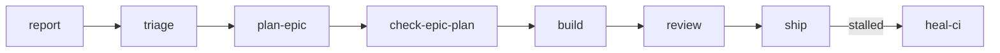

# Developing on phoenix

phoenix is the opinionated stack the kamp.us products (sözlük, pano, mecmua) are built on — a single Cloudflare Worker on alchemy + Effect + fate that serves the SPA, the data plane, and every backend route. It is not a general-purpose framework; it's this repo's engine, written down precisely enough that you can extend it without reverse-engineering the choices.

This is the builder's door. For what kamp.us *is* — the products and the ethos — see [README.md](./README.md).

## Quickstart

```bash
pnpm install
pnpm dev          # vite (SPA + HMR) + alchemy dev (worker on local workerd)
pnpm typecheck    # tsc (Effect-patched) across project references
pnpm deploy       # vite build + alchemy deploy (use --stage <name> for isolation)
```

`alchemy dev` runs the worker locally in `workerd`, but the resources it binds — D1, the live Durable Object — are **real** Cloudflare resources in your personal dev stage. There is no offline emulator (ADR [0032](./.decisions/0032-alchemy-beta45-and-dev-model.md)).

## Stack

| Layer | Choice | What it does for phoenix |
|---|---|---|
| Infra + runtime | [alchemy](https://alchemy.run) `2.0.0-beta.45` | One Effect program declares the worker, its bindings, and the Durable Object. No `wrangler.jsonc`. |
| Effect system | `effect@4.0.0-beta.74` | Backend control flow, services, layers, errors, tracing. |
| Data protocol | [fate](https://github.com/usirin/fate) | `/fate` for data views, `/fate/live` for live views over SSE. Server types are the schema — no codegen artifact between server and client. |
| HTTP | `effect/unstable/http` | `HttpApiBuilder` for typed JSON groups, imperative `HttpRouter` for raw-Request and SSE routes. No Hono, no GraphQL. |
| Auth | `@alchemy.run/better-auth` | BetterAuth on D1 (magic-link + bearer + email/password) via a forked `CloudflareD1` Layer. Session secret comes from the `BETTER_AUTH_SECRET` binding — no default, fails closed if it is missing. |
| DB | Drizzle on D1 | `Drizzle` is a worker-level singleton; feature code calls its `run`/`batch` capability methods. |
| Live state | `LiveDO` on `state.storage` KV | One Durable Object fans out SSE. State is KV — subscriber rows + a per-connection counter. No DO SQL, no DO migrations. |
| Frontend | React 19 + Vite 8 + react-fate | Components declare views; one batched `useRequest` per screen; declarative mutations; live views over SSE. |
| Type-check | `typescript@7` + `@effect/tsgo` | One compiler: the native `tsc`, patched at install with Effect's language service so its diagnostics reach the CLI gate (ADR [0271](./.decisions/0271-one-compiler-effect-patched-tsc.md)). |
| Lint / format | Biome 2 | Tabs, 100 col, no bracket spacing. |
| Package manager | pnpm 10 (workspace catalog) | All commands use `pnpm`; `pnpm dlx`, never `npx`. |

## Architecture

phoenix is a pnpm monorepo with effectively one app — the worker in `apps/web`. The docs live alongside the code: `.decisions/` for the *why*, `.patterns/` for the *how*.

One worker serves the React SPA (built to `dist/client`, served via the `assets` binding) and the API. It keeps precedence on its own paths — `/api/*`, `/fate`, `/fate/*` — and hands everything else to the SPA. The backend is one Effect program: it declares its bindings, hosts the Durable Object, and returns a `fetch` handler.

```
apps/web/
├── alchemy.run.ts         # the stack — state mode + the worker resource
└── worker/
    ├── index.ts           # entry — DO host, bindings, layer assembly
    ├── env.ts             # deploy-time env resolution (fails closed)
    ├── db/                # D1 binding, Drizzle schema, migrations, keyset cursors
    ├── http/              # router composition (app.ts) + health route
    └── features/          # every named grouping, one folder each (all 21 below)
        │                  # — platform & framework concerns —
        ├── fate/          # the fate config + route, layer assembly, barrels
        ├── fate-live/     # the live SSE plane — LiveDO + LivePublisher + protocol
        ├── pasaport/      # authn — better-auth fork + session capability
        ├── kunye/         # authz home (künye) — capability instances + earned standing (ADR 0107)
        ├── flagship/      # feature-flag substrate — Cloudflare Flagship binding + flag IaC (ADR 0081)
        ├── throttle/      # per-actor mutation-volume rate limiter — token bucket (ADR 0177)
        ├── telemetry/     # product-usage telemetry seam over Analytics Engine (ADR 0153)
        ├── lifecycle/     # the uniform soft-removal substrate — EntityLifecycle (ADR 0096)
        ├── search/        # lexical FTS5 site-search over term + post titles (ADR 0080)
        │                  # — products & product surfaces —
        ├── sozluk/        # product — dictionary (sözlük)
        ├── pano/          # product — link aggregator
        ├── mecmua/        # product — long-form publishing (mecmua)
        ├── vote/          # votes on the three targets (definition / post / comment)
        ├── reaction/      # ungated, karma-free emoji reactions — the vote-engine twin
        ├── divan/         # the çaylak proving-ground reviewer surface (divan)
        ├── funnel/        # mod-gated çaylak→yazar conversion-funnel readout
        ├── bildirim/      # notifications — recipient-keyed store + topbar unread badge
        ├── report/        # content-reporting for moderation (bildir)
        ├── rss/           # RSS/Atom feeds of pano/sözlük activity
        ├── stats/         # read-only landing counts
        └── text/          # utility — excerpt()
```

`features/` is the home for **any** named app-level grouping — product domains, framework concerns, and single-file utilities alike. If a concern has a coherent name worth grouping, it's a feature; the few things that aren't (entry, env, db, http) sit beside `features/` (ADR [0036](./.decisions/0036-features-as-any-named-app-grouping.md)). The tree above is the full folder set — keep it in sync with `ls apps/web/worker/features/`, which is authoritative.

**The runtime.** Services are built once and live for the isolate — `Drizzle`, the feature layers, and the composed `FateServer` are assembled into one worker-level `ManagedRuntime` in `worker/index.ts` (init-only: the layer-build vehicle behind the route context layer), not per request. A request to `/fate` provides only the per-request pair (`CurrentUser`, `LivePublisher`) as values and serves through the native interpreter (`FateInterpreter.handleRequest`, `@kampus/fate-effect`) on the request fiber — no runtime, no Effect→Promise hop on the request path. Handlers carry no leftover requirements. Read [.patterns/fate-effect-worker-wiring.md](./.patterns/fate-effect-worker-wiring.md) and [.patterns/fate-effect-interpreter.md](./.patterns/fate-effect-interpreter.md) before touching server-side fate code.

**The live plane.** A single Durable Object, `LiveDO`, fans out SSE. One class plays both roles — it holds a tab's stream (`connection:<id>`) and owns a data key's subscriber registry and fan-out (`topic:<key>`), told apart by instance-name prefix. It reaches its sibling instances through its own namespace, resolved once at init, so every RPC method stays requirement-free. State is `state.storage` KV: subscriber rows plus a per-connection counter that invalidates dead instances. Mutations reach the DO through the per-request `LivePublisher` service, whose publish methods are `Effect<void>` — a failed publish cannot fail the committed mutation. Read [.patterns/effect-sse-externally-driven.md](./.patterns/effect-sse-externally-driven.md); ADRs [0037](./.decisions/0037-unified-void-aligned-live-do.md) (the DO) and [0039](./.decisions/0039-livebus-context-service.md) (the publish-capability service, since folded into `LivePublisher`) are the design.

## Commands

| Command | What it does |
|---|---|
| `pnpm install` | Install workspace dependencies. |
| `pnpm dev` | Two processes: `vite` (SPA, HMR) and `alchemy dev` (worker on workerd). |
| `pnpm dev:web` | Just the Vite SPA dev server. |
| `pnpm dev:worker` | Just `alchemy dev` (worker only). |
| `pnpm build` | `vite build` into `dist/client`. |
| `pnpm deploy` | `pnpm build && alchemy deploy`. Append `--stage <name>` for an isolated worker + D1 + DO. |
| `pnpm typecheck` | `tsc` (Effect-patched) across project references. |
| `pnpm test` | Integration suite — boots the stack on local workerd in `globalSetup`, runs the black-box HTTP suite against it. |
| `pnpm lint` | `biome check .`. |
| `pnpm format` | `biome check --write .`. |

Run Biome through pnpm — `pnpm lint`, `pnpm format`, or `pnpm biome …` — which pins the workspace binary (2.4.15). A bare `biome …` can resolve a stale **global** install (e.g. a homebrew 2.1.1) that doesn't recognize the GritQL node bindings our `biome-plugins/*.grit` rules use, so it prints spurious `Compile Error` lines while loading them. That noise is cosmetic (the run still exits `0`, unaffected via pnpm and in CI) and safe to ignore — but go through pnpm and it won't appear.

## Conventions

- **Effect is the backend control flow.** Services are `Context.Service` classes; methods are `Effect.fn("Service.method")` for free spans; errors are `Data.TaggedError`. Input validation lives in service methods, not the route layer (ADR [0013](./.decisions/0013-validation-in-service-methods.md)).
- **One service per feature folder**, with reads and writes together. A feature owns its full footprint — `queries.ts` / `lists.ts` / `views.ts` / `shapers.ts` / `sources.ts` / `mutations.ts` ([.patterns/per-feature-fate-aggregators.md](./.patterns/per-feature-fate-aggregators.md)).
- **fate is pure transport; Effect services are the domain.** Reads and writes go through service methods — fate never touches the database (ADR [0016](./.decisions/0016-fate-pure-transport-effect-services-domain.md)).
- **One batched request per screen.** A screen root declares its whole view tree in a single `useRequest`; child `useView` calls read from cache. No waterfalls, no imperative cache updaters.
- **No type assertions.** `as any` and `as unknown as` are banned in source (enforced by a Biome GritQL rule); decode at runtime boundaries with `Schema` instead.
- **Make invalid states unrepresentable.** Domain logic lives in domain objects.
- **No `export default`** (ADR [0001](./.decisions/0001-no-export-default.md)) except where the framework demands it (`alchemy.run.ts`, the worker entry, Vite config).
- **Feature flags ship dark, default-off.** Gate a new path behind a flag and read it with the safe value as default — the read never throws, so an outage degrades to the old path. Declaring, reading (server or React), and flipping a flag are all in [.patterns/feature-flags.md](./.patterns/feature-flags.md) (ADR [0081](./.decisions/0081-feature-flag-substrate-cloudflare-flagship.md)).
- **`/lab/*` is the standing prototype space, and it is PUBLIC.** In-product experiments/prototypes mount under `/lab/<name>` as a durable, kept home (not per-spike throwaway), shipped **live to all users with no dev-gate and no dark flag** — the explicit inverse of the flag-gated feature routes. The route-tree shape, the visibility classes, and the `/lab/*` naming/lifecycle convention are in [.patterns/frontend-routing.md](./.patterns/frontend-routing.md).
- **pnpm, not npm.** Biome formatting: tabs, 100 col, no bracket spacing.

Data tasks (seeding, backfills) are one-off direct-D1 scripts against the bound database, not worker routes.

## CI guards

CI runs the base build (`ci.yml` — Biome lint/format, `pnpm typecheck`, the integration suite, the deploy-preview e2e) **plus** a set of narrow, fail-closed guards under [.github/workflows/](./.github/workflows/). Each guard answers "which rule did my PR break?" *before* you trip it on a red run. Most are one `fabrika guard <name> check` invocation and **fail closed on zero scope** (a missing file / empty match reds the build, not passes it — ADR [0092](./.decisions/0092-gates-fail-closed-on-zero-scope.md)); the scan logic lives once in the tool, never re-grepped in the workflow.

| Guard | What it checks | What trips it |
|---|---|---|
| [`ci`](./.github/workflows/ci.yml) | The base build: Biome lint + format, `pnpm typecheck` (Effect-patched `tsc`), the integration suite, the deploy-preview e2e. | A lint/format violation, a type error, a failing test, or a red preview e2e. |
| [`leak-guard`](./.github/workflows/leak-guard.yml) | Changed doc **and shell** surfaces (markdown, `.decisions/`/`.patterns/`, and `.sh`) carry no machine-local/home path or operator PII (the no-local-paths rule). | A `~/`, an absolute home path, a vault, or a sibling-repo path — or an operator email — in a changed doc or script. |
| [`gitleaks`](./.github/workflows/gitleaks.yml) | The PR's new commits for committed secrets (API keys, tokens, private keys). | A credential committed anywhere in the diff. |
| [`fanout-guard`](./.github/workflows/fanout-guard.yml) | Every `Fate.mutation` is classified fanned/not, and each fanned mutation's feature publishes the `/fate/live` invalidation (ADR 0155). | An unclassified mutation, or a fanned mutation whose feature omits the `WorkerLivePublisher` publish. |
| [`readme-guard`](./.github/workflows/readme-guard.yml) | Every `packages/*` workspace member (a dir with `package.json`) carries a `README.md`. | Adding a package without a README. |
| [`migrations-guard`](./.github/workflows/migrations-guard.yml) | The committed D1 migrations tree: the frozen flat `NNNN_*.sql` history plus the `<timestamp>_<name>/migration.sql` directories `drizzle-kit generate` writes — each directory carries its `snapshot.json` and one `.sql`, prefixes are unique and sort after the flat history, and a landed migration's SQL never changes vs the committed baseline (ADR 0309). | Editing a landed migration, hand-adding a flat one, or a directory that would apply ahead of history. |
| [`design-token-guard`](./.github/workflows/design-token-guard.yml) | Component CSS consumes the design-token seam — every `var(--…)` resolves, no raw hex outside `tokens.css`, no off-grid px beyond each file's grandfathered ceiling (ADR 0162). | A dead token ref, a raw hex, or an off-grid px in a component stylesheet. |
| [`a11y-pbt`](./.github/workflows/a11y-pbt.yml) | Property-based a11y invariants over the `apps/web` `ui/` primitives (accessible name, valid ARIA, keyboard focusability). | A primitive that violates an enforced pillar-4 invariant, or a new unclassified primitive. |
| [`doc-links`](./.github/workflows/doc-links.yml) | Every git-tracked `.md`'s relative/internal links resolve on disk, repo-wide (via lychee). | A dead internal link — including one orphaned by a rename outside your own diff. |
| [`pointer-guard`](./.github/workflows/pointer-guard.yml) | Backticked repo-path pointers in `**/CLAUDE.md` resolve on disk. | A moved/renamed file behind a backticked path pointer in a CLAUDE.md. |
| [`codeowners-cp`](./.github/workflows/codeowners-cp.yml) | Every §CP control-plane path (from the canonical regex) has a covering `.github/CODEOWNERS` row. | Adding a §CP path to the regex without a CODEOWNERS entry. |
| [`path-filter-guard`](./.github/workflows/path-filter-guard.yml) | `deploy.yml`'s `changes.deploy` and `ci.yml`'s `changes.e2e` paths-filter lists are the same set of globs, read against the same `(token, base)` diff basis. | Editing one paths-filter list without the other, or giving the two steps different dorny inputs. |
| [`change-detect-guard`](./.github/workflows/change-detect-guard.yml) | `ci.yml`'s `changes` job detects changed files with a pure `git diff` — its paths-filter step pins `token: ''`. | Setting or dropping the `token:` on that step, which selects the flaky GitHub-API read. |
| [`settings-env-guard`](./.github/workflows/settings-env-guard.yml) | No `.claude/settings.json` `env` value carries an unexpanded `${…}` token (applied verbatim, so it never resolves). | A `${VAR}` left literal in a settings env value. |
| [`skill-gh-lint`](./.github/workflows/skill-gh-lint.yml) | The skill + agent corpus: REST-only `gh` (no GraphQL paths), valid frontmatter YAML, no bare `git push` in a runnable block, and no `./claude-plugins/…` literal in a fence. | A `gh project` / GraphQL call, malformed `---` frontmatter, a bare push, or a repo-only path literal in a SKILL.md / agents/*.md. |
| [`decisions-index`](./.github/workflows/decisions-index.yml) | The `.decisions/*` ADR files carry the four index fields, no duplicate `id`, and no filename ↔ front-matter number mismatch. | A new ADR that collides on number, mismatches its filename, or drops an index field. |
| [`design-inventory-guard`](./.github/workflows/design-inventory-guard.yml) | `design-system-inventory.md` is a fresh extraction of the `components/ui` JSDoc, and the extraction path never touches the founder-authored `design-system-manifest.md` (ADR 0194). | Changing a primitive's `@component` JSDoc without regenerating the inventory. |

Not every workflow is a PR gate. [`run-evidence`](./.github/workflows/run-evidence.yml) *produces* the SHA-bound run-evidence artifact the `ship` gate consumes (ADR [0054](./.decisions/0054-run-evidence-bundle.md)); [`deploy`](./.github/workflows/deploy.yml) / [`pr-cleanup`](./.github/workflows/pr-cleanup.yml) stand up and tear down per-PR preview stacks; [`changelog`](./.github/workflows/changelog.yml) / [`publish`](./.github/workflows/publish.yml) fire on a release tag; and [`epic-autoclose`](./.github/workflows/epic-autoclose.yml), [`orphan-sweep`](./.github/workflows/orphan-sweep.yml), [`glossary-drift`](./.github/workflows/glossary-drift.yml) and [`pitch-guard`](./.github/workflows/pitch-guard.yml) run on an issue event or a schedule rather than on your PR. Ground truth for the full set is `ls .github/workflows/`.

## The pipeline

phoenix extends itself through an agent-operable issue-intake pipeline: an agent files what it notices, triage makes it actionable, then the work is planned, executed, reviewed, and shipped. Each stage consumes the previous stage's output and produces a signal the next stage trusts — a verification gate sits at every stage.

**That pipeline is fabrika, and it is the only one phoenix runs.** fabrika ships as its own plugin, external consumers install it from the `kampus` marketplace on GitHub, and you reach a skill by its namespaced name — `fabrika:build` — never by a path into the repo (ADR [0273](./.decisions/0273-fabrika-ships-as-an-installed-plugin.md)). Working in this repo, register the checkout itself as the marketplace source and install from it — once per machine, from the repo root:

```bash
claude plugin marketplace add ./
claude plugin install fabrika@kampus
```

Both lines are needed on a fresh clone: the `add` registers the marketplace and installs nothing, so skipping the `install` leaves `/reload-plugins` with zero fabrika skills and no error naming the cause (verified on Claude Code 2.1.234). If your machine is already on the GitHub `kampus` marketplace, run the same `marketplace add ./` — on 2.1.234 it overwrites that entry's source in place and the installed plugin survives. Do not run `claude plugin marketplace remove kampus` first: removing a marketplace also uninstalls its plugins, so you would then have to reinstall.

Skills and agents then load straight from `claude-plugins/fabrika/` in your working tree — a merged (or even local) plugin change is live on the next `/reload-plugins`, with no `/plugin` update step (ADR 0273's 2026-08-16 amendment; the history is on [#5705](https://github.com/kamp-us/phoenix/issues/5705)). Nothing in `.claude/settings.json` registers the marketplace for you; every collaborator runs the two lines above on their own machine. The table below links each skill's `SKILL.md` so you can read the source; those links are for reading, not for invoking. The roster it replaced is retired: fabrika re-implements v1's work instead of calling into it (ADR [0238](./.decisions/0238-fabrika-reimplements-v1-never-calls-it.md)), and the v1 `kampus-pipeline` plugin is deleted outright — its tree, hooks and agents, plus the `.claude` symlinks, the settings hook entries and the `drive-issue.js` workflow that read them ([#5937](https://github.com/kamp-us/phoenix/issues/5937); the retirement history is ADRs [0277](./.decisions/0277-v1-retirement-keeps-the-plugin-suppression.md)/[0279](./.decisions/0279-v1-crew-retired-in-full.md)). One trace stays on purpose: the `kampus-pipeline` entry in [`.claude-plugin/marketplace.json`](./.claude-plugin/marketplace.json), whose `git-subdir` source is pinned to a sha, so a repo outside phoenix that already installed the suite keeps resolving it from history rather than from this tree. fabrika is the one pipeline.

Only `ship` merges, and it enqueues for the merge queue rather than merging by hand. On a control-plane PR (`.claude`/`.github`) it holds until a control-plane owner has approved the current head — ADR [0135](./.decisions/0135-hard-gate-control-plane-team-codeowners-approve-then-enqueue.md), which amends ADR [0053](./.decisions/0053-control-plane-boundary.md)'s hand-merge model to approve-then-enqueue.



| Skill | Stage | Role |
|---|---|---|
| [`report`](./claude-plugins/fabrika/skills/report/SKILL.md) | intake | File a follow-up issue the moment you spot tangential work; it lands carrying `status:needs-triage` and nothing else. |
| [`triage`](./claude-plugins/fabrika/skills/triage/SKILL.md) | classify | Turn one raw needs-triage issue into a unit a builder can pick up cold: classified, enriched from the code, priced, homed, addressed. |
| [`plan-epic`](./claude-plugins/fabrika/skills/plan-epic/SKILL.md) | plan | Decompose a triaged epic into a task ledger; the product layer leads, tracer-bullet children each trace to a user story, with a pinned `## Dependencies` topology. |
| [`check-epic-plan`](./claude-plugins/fabrika/skills/check-epic-plan/SKILL.md) | gate | Gate that ledger against a deterministic structural floor, then flip its children pickable. |
| [`build`](./claude-plugins/fabrika/skills/build/SKILL.md) | execute | Execute one agent-ready issue end to end — claim, branch, construct in a verified tree, open the PR. Given a PR number instead, it is the repair lane for that PR's findings. |
| [`review`](./claude-plugins/fabrika/skills/review/SKILL.md) | gate | Judge a PR's textual artifacts — code, docs, skills — against the linked issue's acceptance criteria, landing one SHA-bound verdict per artifact class. Never merges. |
| [`ship`](./claude-plugins/fabrika/skills/ship/SKILL.md) | merge | The single merge authority. Walks the guard chain (scope, control-plane approval, verdicts, CI at head, run-evidence, threads), enqueues, then reconciles the terminal outcome. |
| [`heal-ci`](./claude-plugins/fabrika/skills/heal-ci/SKILL.md) | self-heal | Answer why a PR is not moving and drive it back: one transient rerun, a route to the lane that owns the work, or a named human escalation. |

**That table is the chain, not the roster.** The full set is [`claude-plugins/fabrika/skills/`](./claude-plugins/fabrika/skills/), one directory per skill — get it the way you get the ADRs (ADR [0129](./.decisions/0129-adr-discovery-is-the-claude-md-contract.md)): `ls claude-plugins/fabrika/skills/` for the names, each `SKILL.md`'s frontmatter for its one-line description. Beside the chain sit the rendered-visual twins (`build-ui`, `review-ui`), the lane driver (`operate`), the ideation skills that turn fog into a spec (`wayfinding`, `grilling`, `prototyping`, `graduate`, `handoff`), the knowledge surfaces (`adr`, `write-pattern`, `glossary`), the harness-integrity gate (`governance`), and the cold-session door (`front-door`, typed as `/fabrika`).

One trap when you map an old name onto a fabrika one: the nouns moved. `build` is the text-construction skill and `review` is a single skill, not v1's `review-*` family (ADR [0242](./.decisions/0242-fabrika-skill-nouns-redefine-build-and-review.md)). The conventions every fabrika skill is held to live in [`claude-plugins/fabrika/docs/`](./claude-plugins/fabrika/docs/README.md).

Those two surfaces are written for agents. The pages written for a person — how to adopt fabrika, how it decides things, why it is shaped this way — are in [`claude-plugins/fabrika/guide/`](./claude-plugins/fabrika/guide/README.md).

## Releasing

The pipeline above lands PRs on `main`. This section is what takes `main` to npm.
One `@kampus/*` package publishes today — [`fabrika-cli`](./packages/fabrika-cli) — and the
authoritative list is the tag-match arms in
[`.github/workflows/publish.yml`](./.github/workflows/publish.yml), not this paragraph.

The *why* is ADR [0239](./.decisions/0239-release-please-manifest-mode-version-derivation.md);
the shape of the path and the constraints a change to it must not break are
[.patterns/release-path.md](./.patterns/release-path.md).

### How a version gets derived

Nobody types a version number. Every push to `main` runs
[`release-please.yml`](./.github/workflows/release-please.yml), which reads the conventional
commits since the last release and works out each package's next version.

**Routing is by changed file path, not by commit scope.** A commit is assigned to a package by
the files it touched, so a commit written `fix(guards): …` whose diff only touches
`packages/fabrika-cli/` bumps **fabrika-cli**. Your scope string is changelog prose; your diff
is what decides. A commit touching no package root bumps nothing.

### The standing Release PR

The answer is parked in one long-lived pull request — titled `chore: release main`, on the
branch `release-please--branches--main`, opened by `github-actions[bot]` — that is re-groomed
on every push to `main` and sits there until a human merges it. Merging it *is* the release
act; ADR [0083](./.decisions/0083-agents-deploy-humans-release.md) survives by construction,
since only the number is automated.

It covers **all** configured package roots at once (`separate-pull-requests: false`), so one
merge can cut several releases the day a second root is configured again.

**Before you merge one, check:**

- **The commit range is what you expect.** Skim the PR's per-package changelog sections. An
  unexpectedly long list means the history boundary (`last-release-sha` /`bootstrap-sha` in
  [`release-please-config.json`](./release-please-config.json)) is wrong, and merging folds the
  whole backlog into one version.
- **Each derived version is the one you want.** npm versions are **immutable**: a wrong number,
  or a release that fires before a rename or manifest fix has landed on `main`, is baked into
  the registry permanently and can only be superseded by a higher version. This is the one
  check with no undo.
- **Everything the release depends on is already on `main`.** The publish job builds from the
  *tagged* tree, so anything merged after the tag is not in the tarball.

### What merging it does

1. Version bumps and per-package `CHANGELOG.md` updates land on `main`.
2. A tag `<unscoped-name>-v<version>` (e.g. `fabrika-cli-v0.3.0`) is created **per released
   package**, each with a GitHub Release.
3. Each `release: published` event fires [`publish.yml`](./.github/workflows/publish.yml) —
   once per tag, resolving that tag's prefix to one workspace member. It checks out the tagged
   tree, installs, typechecks, builds `src/` → `dist/` (the tarball ships compiled JS, never raw
   `.ts`), then `pnpm publish`es under a short-lived OIDC credential. It is `pnpm publish`, not
   `npm publish`, because npm cannot resolve this repo's `catalog:` specifiers.
4. The same tag also fires [`changelog.yml`](./.github/workflows/changelog.yml), which
   regenerates the **root** `CHANGELOG.md` from pipeline metadata (ADR
   [0069](./.decisions/0069-derived-changelog-from-shipped-work.md)). That is a separate file
   from the per-package changelogs release-please writes.

Nothing in step 1–2 publishes: `release-please.yml` holds no registry credential.

### Reading a red publish run

Where the run dies tells you what broke:

| Fails at | Meaning |
|---|---|
| **Resolve the release tag** (before install) | The tag prefix matches no published package, or the tag version disagrees with that package's `package.json`. A real defect — nothing published. |
| **Typecheck / build** | A genuine break in the tagged tree. Nothing published. |
| **Publish, with a 403** | An OIDC failure: the Trusted Publisher registration does not match this workflow — either it never did, or it stopped. See below. |

**Reading a 403.** Auth is OIDC Trusted Publishing with **no `NPM_TOKEN` fallback**, and each
package's registration is a one-time human step on npmjs.com. A 403 means that registration
**does not match** this workflow — and it has two branches, so read which one you are in before
hunting a regression:

- **It never matched** — this is the registration's *first* use. A package is past that point
  once it has a green publish run and a published artifact carrying the attestations only an
  OIDC publish stamps. `fabrika-cli`'s registration is recorded on
  [#4800](https://github.com/kamp-us/phoenix/issues/4800), which pastes npm's own confirmation
  (this repo, workflow file `publish.yml`).
- **It stopped matching** — a registration that had been working no longer does, and one of the
  two hazards below is the usual cause.

Registration state is a **web-UI fact**: npm exposes no trusted-publisher field over the CLI or
the registry API, so nothing here can re-check it — npmjs.com (Settings → Publishing) is the
only authority.

When a 403 does fire it arrives *after* install, typecheck and build have all gone green. That
lateness makes it read like a broken build; it is not. It is the path failing closed on missing
authorization, and nothing is corrupted by it — **no version number is burned**, because nothing
was published, and re-running the release after fixing the registration recovers cleanly.

**Two ways to invalidate a registration, both silent until a release 403s:**

- **Renaming `publish.yml`**, or adding a second publish workflow — each registration names
  that exact filename.
- **Adding an `environment:` key to `publish.yml`.** The workflow declares none, and the
  registration on #4800 was made with npm's environment field deliberately empty to match. Add
  one without editing the registrations in the **same change** and the OIDC claim stops
  matching.

### Adding a third published package

It is not a code-only change: a package that does not exist on the registry cannot have a
Trusted Publisher registered, so its **first** publish is a human `pnpm publish` and CI can only
take over afterwards. The full ordered procedure — including the resolve arm, the
release-please config and manifest entries, the per-path gate, the bootstrap publish and the
registration — is in
[.patterns/release-path.md → Adding a third published package](./.patterns/release-path.md#adding-a-third-published-package).

## Ops runbooks

When the running system breaks, the procedures live in **[ops/](./ops/README.md)** — a peer
operational doc surface alongside this file. It carries the failure-mode runbooks (D1 restore,
live plane degraded, Cloudflare down) and the measured capacity baseline, each grounded in
phoenix's real stack. It sits apart from `.decisions/` (the *why*) and `.patterns/` (how the
code is shaped) on purpose: `ops/` is **how to operate** the system during an incident. Start at
[ops/README.md](./ops/README.md).

## Where to read deeper

Two doc surfaces carry the rest: **[.decisions/](./.decisions/)** holds the ADRs — the *why* behind each choice and the history of how it got here; **[.patterns/](./.patterns/index.md)** describes *how* the current code is shaped. Read a pattern when you're about to write that kind of code; read an ADR when you want to revisit a decision. New decisions go through `/adr`. When a doc and `apps/web/worker/` disagree, the source wins — fix the doc.

**New here? Read in this order:**

1. This file — the shape and the rules.
2. ADR [0032](./.decisions/0032-alchemy-beta45-and-dev-model.md) — the dev model: real Cloudflare resources, worker runs locally.
3. [.patterns/fate-effect-worker-wiring.md](./.patterns/fate-effect-worker-wiring.md) + [.patterns/fate-effect-interpreter.md](./.patterns/fate-effect-interpreter.md) — how an HTTP request becomes domain code.
4. [.patterns/per-feature-fate-aggregators.md](./.patterns/per-feature-fate-aggregators.md) — the footprint you'll copy when adding a feature.

Then open the feature folder you're working in and follow its neighbors.
