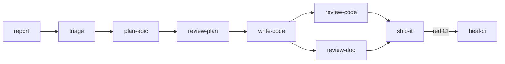

# phoenix

kamp.us, reborn. A single Cloudflare Worker on alchemy + Effect + fate that serves the SPA, the data plane, and every backend route.

It is not a general-purpose framework. It is the opinionated stack the kamp.us products (sozluk, pano, vote, stats) are built on, written down precisely enough that you can extend it without reverse-engineering the choices.

## Quickstart

```bash
pnpm install
pnpm dev          # vite (SPA + HMR) + alchemy dev (worker on local workerd)
pnpm typecheck    # effect-tsgo across project references
pnpm deploy       # vite build + alchemy deploy (use --stage <name> for isolation)
```

`alchemy dev` runs the worker locally in `workerd`, but the resources it binds — D1, the live Durable Object — are **real** Cloudflare resources in your personal dev stage. There is no offline emulator (ADR [0032](./.decisions/0032-alchemy-beta45-and-dev-model.md)).

## Stack

| Layer | Choice | What it does for phoenix |
|---|---|---|
| Infra + runtime | [alchemy](https://alchemy.run) `2.0.0-beta.45` | One Effect program declares the worker, its bindings, and the Durable Object. No `wrangler.jsonc`. |
| Effect system | `effect@4.0.0-beta.74` | Backend control flow, services, layers, errors, tracing. |
| Data protocol | [fate](https://github.com/usirin/fate) | `/fate` for data views, `/fate/live` for live views over SSE. Server types are the schema — no codegen artifact between server and client. |
| HTTP | `effect/unstable/http` | `HttpApiBuilder` for typed JSON groups, imperative `HttpRouter` for raw-Request and SSE routes. No Hono, no GraphQL. |
| Auth | `@alchemy.run/better-auth` | BetterAuth on D1 (magic-link + bearer + email/password) via a forked `CloudflareD1` Layer. Session secret comes from the `BETTER_AUTH_SECRET` binding — no default, fails closed if it is missing. |
| DB | Drizzle on D1 | `Drizzle` is a worker-level singleton; feature code calls its `run`/`batch` capability methods. |
| Live state | `LiveDO` on `state.storage` KV | One Durable Object fans out SSE. State is KV — subscriber rows + a per-connection counter. No DO SQL, no DO migrations. |
| Frontend | React 19 + Vite 8 + react-fate | Components declare views; one batched `useRequest` per screen; declarative mutations; live views over SSE. |
| Type-check | `@effect/tsgo` | Fast `tsc` plus Effect's LSP. |
| Lint / format | Biome 2 | Tabs, 100 col, no bracket spacing. |
| Package manager | pnpm 10 (workspace catalog) | All commands use `pnpm`; `pnpm dlx`, never `npx`. |

## Architecture

phoenix is a pnpm monorepo with effectively one app — the worker in `apps/web`. The docs live alongside the code: `.decisions/` for the *why*, `.patterns/` for the *how*.

One worker serves the React SPA (built to `dist/client`, served via the `assets` binding) and the API. It keeps precedence on its own paths — `/api/*`, `/fate`, `/fate/*` — and hands everything else to the SPA. The backend is one Effect program: it declares its bindings, hosts the Durable Object, and returns a `fetch` handler.

```
apps/web/
├── alchemy.run.ts         # the stack — state mode + the worker resource
└── worker/
    ├── index.ts           # entry — DO host, bindings, layer assembly
    ├── env.ts             # deploy-time env resolution (fails closed)
    ├── db/                # D1 binding, Drizzle schema, migrations, keyset cursors
    ├── http/              # router composition (app.ts) + health route
    └── features/          # every named grouping, one folder each
        ├── fate/          # the fate config + route, layer assembly, barrels
        ├── fate-live/     # the live SSE plane — LiveDO + LivePublisher + protocol
        ├── pasaport/      # auth — better-auth fork + session capability
        ├── sozluk/        # product — dictionary
        ├── pano/          # product — link aggregator
        ├── vote/          # product — votes
        ├── stats/         # product — read-only counts
        └── text/          # utility — excerpt()
```

`features/` is the home for **any** named app-level grouping — product domains, framework concerns, and single-file utilities alike. If a concern has a coherent name worth grouping, it's a feature; the few things that aren't (entry, env, db, http) sit beside `features/` (ADR [0036](./.decisions/0036-features-as-any-named-app-grouping.md)).

**The runtime.** Services are built once and live for the isolate — `Drizzle`, the feature layers, and the composed `FateServer` are assembled into one worker-level `ManagedRuntime` in `worker/index.ts` (init-only: the layer-build vehicle behind the route context layer), not per request. A request to `/fate` provides only the per-request pair (`CurrentUser`, `LivePublisher`) as values and serves through the native interpreter (`FateInterpreter.handleRequest`, `@kampus/fate-effect`) on the request fiber — no runtime, no Effect→Promise hop on the request path. Handlers carry no leftover requirements. Read [.patterns/fate-effect-worker-wiring.md](./.patterns/fate-effect-worker-wiring.md) and [.patterns/fate-effect-interpreter.md](./.patterns/fate-effect-interpreter.md) before touching server-side fate code.

**The live plane.** A single Durable Object, `LiveDO`, fans out SSE. One class plays both roles — it holds a tab's stream (`connection:<id>`) and owns a data key's subscriber registry and fan-out (`topic:<key>`), told apart by instance-name prefix. It reaches its sibling instances through its own namespace, resolved once at init, so every RPC method stays requirement-free. State is `state.storage` KV: subscriber rows plus a per-connection counter that invalidates dead instances. Mutations reach the DO through the per-request `LivePublisher` service, whose publish methods are `Effect<void>` — a failed publish cannot fail the committed mutation. Read [.patterns/effect-sse-externally-driven.md](./.patterns/effect-sse-externally-driven.md); ADRs [0037](./.decisions/0037-unified-void-aligned-live-do.md) (the DO) and [0039](./.decisions/0039-livebus-context-service.md) (the publish-capability service, since folded into `LivePublisher`) are the design.

## Commands

| Command | What it does |
|---|---|
| `pnpm install` | Install workspace dependencies. |
| `pnpm dev` | Two processes: `vite` (SPA, HMR) and `alchemy dev` (worker on workerd). |
| `pnpm dev:web` | Just the Vite SPA dev server. |
| `pnpm dev:worker` | Just `alchemy dev` (worker only). |
| `pnpm build` | `vite build` into `dist/client`. |
| `pnpm deploy` | `pnpm build && alchemy deploy`. Append `--stage <name>` for an isolated worker + D1 + DO. |
| `pnpm typecheck` | `effect-tsgo` across project references. |
| `pnpm test` | Integration suite — boots the stack on local workerd in `globalSetup`, runs the black-box HTTP suite against it. |
| `pnpm lint` | `biome check .`. |
| `pnpm format` | `biome check --write .`. |

## Conventions

- **Effect is the backend control flow.** Services are `Context.Service` classes; methods are `Effect.fn("Service.method")` for free spans; errors are `Data.TaggedError`. Input validation lives in service methods, not the route layer (ADR [0013](./.decisions/0013-validation-in-service-methods.md)).
- **One service per feature folder**, with reads and writes together. A feature owns its full footprint — `queries.ts` / `lists.ts` / `views.ts` / `shapers.ts` / `sources.ts` / `mutations.ts` ([.patterns/per-feature-fate-aggregators.md](./.patterns/per-feature-fate-aggregators.md)).
- **fate is pure transport; Effect services are the domain.** Reads and writes go through service methods — fate never touches the database (ADR [0016](./.decisions/0016-fate-pure-transport-effect-services-domain.md)).
- **One batched request per screen.** A screen root declares its whole view tree in a single `useRequest`; child `useView` calls read from cache. No waterfalls, no imperative cache updaters.
- **No type assertions.** `as any` and `as unknown as` are banned in source (enforced by a Biome GritQL rule); decode at runtime boundaries with `Schema` instead.
- **Make invalid states unrepresentable.** Domain logic lives in domain objects.
- **No `export default`** (ADR [0001](./.decisions/0001-no-export-default.md)) except where the framework demands it (`alchemy.run.ts`, the worker entry, Vite config).
- **Feature flags ship dark, default-off.** Gate a new path behind a flag and read it with the safe value as default — the read never throws, so an outage degrades to the old path. Declaring, reading (server or React), and flipping a flag are all in [.patterns/feature-flags.md](./.patterns/feature-flags.md) (ADR [0081](./.decisions/0081-feature-flag-substrate-cloudflare-flagship.md)).
- **pnpm, not npm.** Biome formatting: tabs, 100 col, no bracket spacing.

Data tasks (seeding, backfills) are one-off direct-D1 scripts against the bound database, not worker routes.

## The pipeline

phoenix extends itself through an agent-operable issue-intake pipeline in `.claude/skills/`: an agent files what it notices, triage makes it actionable, then the work is planned, executed, reviewed, and shipped. Each stage consumes the previous stage's output and produces a signal the next stage trusts — a verification gate sits at every stage. Only [`ship-it`](./.claude/skills/ship-it/SKILL.md) merges, and it refuses to merge the pipeline's own control plane (`.claude`/`.github` PRs), which a human merges by hand — ADR [0053](./.decisions/0053-control-plane-boundary.md).



| Skill | Stage | Role |
|---|---|---|
| [`report`](./.claude/skills/report/SKILL.md) | intake | File a follow-up issue the moment you spot tangential work; tags `status:needs-triage` and nothing else. |
| [`triage`](./.claude/skills/triage/SKILL.md) | classify | Process the needs-triage queue: classify, enrich, prioritize, split, or close. The guardrail between raw intake and pickable work. |
| [`plan-epic`](./.claude/skills/plan-epic/SKILL.md) | plan | Turn a triaged epic into a PRD-grade task ledger; product layer leads, split into tracer-bullet sub-issues with a pinned `## Dependencies` topology. |
| [`review-plan`](./.claude/skills/review-plan/SKILL.md) | gate | Verify the epic ledger against a deterministic structural floor before its children become pickable. |
| [`write-code`](./.claude/skills/write-code/SKILL.md) | execute | Pick the next actionable issue, implement it on a branch, open a PR that closes it, hand off to the parent epic. |
| [`review-code`](./.claude/skills/review-code/SKILL.md) | gate | Fresh-eyes QA: verify a PR against its issue's acceptance criteria, one criterion at a time, evidence-based. Never merges. |
| [`review-doc`](./.claude/skills/review-doc/SKILL.md) | gate | The doc-artifact twin of review-code, plus a doc-hygiene checklist, for `.decisions`/`.patterns`/prose PRs. |
| [`ship-it`](./.claude/skills/ship-it/SKILL.md) | merge | The only skill with merge authority. Asserts the matching gate signalled PASS and CI is green, squash-merges, confirms the issue auto-closed. Refuses to self-merge control-plane (`.claude`/`.github`) PRs. |
| [`heal-ci`](./.claude/skills/heal-ci/SKILL.md) | self-heal | Classify a red CI run into flake-vs-defect; rerun a known transient once, or file a defect via report. ship-it hands off here when checks come back red. |

Two more skills serve the docs rather than the chain: [`adr`](./.claude/skills/adr/SKILL.md) records a decision in `.decisions/`, and [`deslop-comments`](./.claude/skills/deslop-comments/SKILL.md) cuts comments that bury the code.

## Where to read deeper

Two doc surfaces carry the rest: **[.decisions/](./.decisions/)** holds the ADRs — the *why* behind each choice and the history of how it got here; **[.patterns/](./.patterns/index.md)** describes *how* the current code is shaped. Read a pattern when you're about to write that kind of code; read an ADR when you want to revisit a decision. New decisions go through `/adr`. When a doc and `apps/web/worker/` disagree, the source wins — fix the doc.

**New here? Read in this order:**

1. This file — the shape and the rules.
2. ADR [0032](./.decisions/0032-alchemy-beta45-and-dev-model.md) — the dev model: real Cloudflare resources, worker runs locally.
3. [.patterns/fate-effect-worker-wiring.md](./.patterns/fate-effect-worker-wiring.md) + [.patterns/fate-effect-interpreter.md](./.patterns/fate-effect-interpreter.md) — how an HTTP request becomes domain code.
4. [.patterns/per-feature-fate-aggregators.md](./.patterns/per-feature-fate-aggregators.md) — the footprint you'll copy when adding a feature.

Then open the feature folder you're working in and follow its neighbors.
