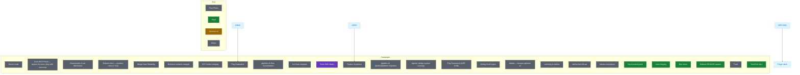

# kamp.us — Roadmap

> The living roadmap of kamp.us: the founder-voice source of direction. GitHub milestones are its operational projection. Agents ground in this file the way they ground in an ADR — it says *what we build next, and why*, in order. Conversation-authored (ADR-0075 idiom); revised at arc boundaries or when the founder calls it. Not a pipeline surface — this is product direction (ADR 0078).

## What kamp.us is

kamp.us, reborn. A small, earnest community built around three products — **sözlük** (the community of definitions), **pano** (the shared board of links and posts), and **mecmua** (long-form publishing) — bound by **künye**, earned-authorship identity: you arrive a çaylak and become a yazar by vouch (kefil), not by signup. Quality over growth; the founders are the first users; nothing seeded. An autonomous software factory builds it.

## How this roadmap works

Direction flows top-down: **vision → arcs → milestones → epics → features.** An **arc** is a themed chapter of work, projected onto a GitHub milestone. **Exactly one arc is active** at a time — it defines "now," and priority is relative to it (`p1` = current arc). The intake pipeline stays deliberately direction-blind; this roadmap is the layer that gives it direction. When an arc flips active, stale priorities re-price against the new active arc.

## Dependency graph

Generated top-down view of the roadmap: every **arc** and **campaign** is a node styled by its lifecycle state (active / queued / paused / done); edges are the real cross-item dependencies declared in the [`## Dependencies`](#dependencies) section below. GitHub renders this natively on the repo page. It was generated from the tables; the generator was deleted with the v1 verb package (#6100), so the block is hand-maintained against the tables until a `fabrika` verb owns it again.

```mermaid
%% Was generated; its generator retired with the v1 verb package (#6100) — keep in step with the tables by hand.
%% Nodes = every ## Arcs / ## Campaigns row (styled by state); edges = ## Dependencies rows (#3870).
flowchart TD
	subgraph arcs["Arcs"]
		arc_four_pillars["Four Pillars"]:::done
		arc_ge_it["Geçit"]:::active
		arc_mecmua_v2["Mecmua v2"]:::queued
		arc_at_lye["Atölye"]:::done
	end
	subgraph campaigns["Campaigns"]
		camp_mentor_audit["Mentor Audit"]:::done
		camp_crew_mcp_finish_replace_the_tmux_relay_with_crew_mcp["Crew-MCP Finish — replace the tmux relay with crew-mcp"]:::done
		camp_deterministic_crew_mechanics["Deterministic Crew Mechanics"]:::done
		camp_di_taxis_docs_pipeline_crew_mcp["Diátaxis docs — pipeline-crew & -mcp"]:::done
		camp_merge_gate_reliability["Merge-Gate Reliability"]:::done
		camp_worktree_isolation_integrity["Worktree-Isolation Integrity"]:::done
		camp_cp_verdict_integrity["§CP Verdict Integrity"]:::done
		camp_flag_graduation["Flag Graduation"]:::done
		camp_pipeline_cli_glue_consolidation["pipeline-cli Glue Consolidation"]:::done
		camp_lint_gate_adoption["Lint-Gate Adoption"]:::done
		camp_taste_skill_library["Taste-Skill Library"]:::paused
		camp_pipeline_anywhere["Pipeline Anywhere"]:::done
		camp_pipeline_cli_effect_platform_migration["pipeline-cli @effect/platform migration"]:::done
		camp_agentic_design_system_coverage["Agentic design-system coverage"]:::done
		camp_flag_retirement_adr_0136["Flag Retirement (ADR 0136)"]:::done
		camp_writing_craft_import["Writing-Craft Import"]:::done
		camp_fabrika_kampus_pipeline_v2["fabrika — kampus-pipeline v2"]:::done
		camp_switching_to_fabrika["switching to fabrika"]:::done
		camp_fabrika_fast_follows["fabrika fast follows"]:::done
		camp_fabrika_everywhere["fabrika everywhere"]:::done
		camp_ge_it_product_push["Geçit product push"]:::active
		camp_lane_integrity["Lane integrity"]:::active
		camp_epic_lanes["Epic lanes"]:::active
		camp_di_taxis_readme_passes["Diátaxis README passes"]:::active
		camp_tuval["Tuval"]:::done
		camp_tuval_first_slice["Tuval first slice"]:::active
	end
	ext_3642["#3642"]:::external
	ext_3833["#3833"]:::external
	ext_adr_0202["ADR 0202"]:::external
	ext_triage_rubric["Triage rubric"]:::external
	ext_3642 --> camp_flag_graduation
	ext_3833 --> camp_pipeline_anywhere
	ext_adr_0202 --> ext_triage_rubric
	classDef active fill:#1a7f37,stroke:#116329,color:#ffffff;
	classDef queued fill:#9a6700,stroke:#7d4e00,color:#ffffff;
	classDef paused fill:#6639ba,stroke:#4c2889,color:#ffffff;
	classDef done fill:#57606a,stroke:#424a53,color:#ffffff;
	classDef external fill:#ddf4ff,stroke:#54aeff,color:#0550ae,stroke-dasharray:5 5;
```

## Arcs

| Arc | Milestone | State |
|-----|-----------|-------|
| Four Pillars | #17 | done |
| Geçit | #24 | active |
| Mecmua v2 | #25 | queued |
| Atölye | #26 | done |

**Four Pillars** — *done.* Frontend polish and the encoded design system: the four pillars — Performance, Cohesiveness, Usability, Accessibility — made real and enforced (ADR 0162, the design-system manifest). The surface of kamp.us becomes excellent and self-consistent. The nav-IA discipline landed here.

**Geçit** — *active. The passage.* The membrane of the community: onboarding, künye (the reputation DO), and moderation. How a stranger becomes a çaylak, a çaylak becomes a yazar by vouch, and how the community governs itself. The çaylak→yazar journey — undefined today — gets designed here. (The earlier künye milestone folded in.)

**Mecmua v2** — The next chapter of long-form publishing: the Thinking-Machines 3-zone reading layout, and the reading/authoring experience maturing past v1.

**Atölye** — *the workshop.* The in-product museum of craft: curated exhibits, live and playable, where kamp.us shows how it is made.

## Campaigns

Campaigns are bounded, milestone-backed pushes that run *concurrently* with the active product arc, drained through the platform lane (ADR 0072 semantics; ADR 0078 engineering-led). **A row's `State` cell is the dispatch permission**: an agent may open lanes against exactly the milestones whose row says `active` (ADR 0304). There is no second declaration surface — this cell is the whole answer.

| Campaign | Milestone | State |
|----------|-----------|-------|
| Mentor Audit | #27 | done |
| Crew-MCP Finish — replace the tmux relay with crew-mcp | #28 | done |
| Deterministic Crew Mechanics | #29 | done |
| Diátaxis docs — pipeline-crew & -mcp | #31 | done |
| Merge-Gate Reliability | #36 | done |
| Worktree-Isolation Integrity | #37 | done |
| §CP Verdict Integrity | #38 | done |
| Flag Graduation | #39 | done |
| pipeline-cli Glue Consolidation | #40 | done |
| Lint-Gate Adoption | #41 | done |
| Taste-Skill Library | #42 | paused |
| Pipeline Anywhere | #35 | done |
| pipeline-cli @effect/platform migration | #32 | done |
| Agentic design-system coverage | #33 | done |
| Flag Retirement (ADR 0136) | #34 | done |
| Writing-Craft Import | #30 | done |
| fabrika — kampus-pipeline v2 | #44 | done |
| switching to fabrika | #45 | done |
| fabrika fast follows | #46 | done |
| fabrika everywhere | #47 | done |
| Geçit product push | #24 | active |
| Lane integrity | #48 | active |
| Epic lanes | #49 | active |
| Diátaxis README passes | #50 | active |
| Tuval | #51 | done |
| Tuval first slice | #52 | active |
| phoenix i18n | #53 | active |

**The table is a parsed contract.** It is the single source whatever writes a campaign row (appending it `paused` and later flipping its state) and the lifecycle guard that reads it both bind to, so the grammar is pinned here rather than re-derived at either end:

- **Columns** are `Campaign | Milestone | State`, in that order. `Campaign` is the founder-voice name; `Milestone` pins the campaign to its GitHub milestone **by number** (`#N`) — the same row→milestone-by-number binding the roadmap-guard already enforces on `## Arcs`, and that number is the one link to the operational projection. `State` is the lifecycle cell.
- **`State ∈ {active, paused, done}`** — the lifecycle cell, and the dispatch permission with it. `active` means the milestone is draining *and* lanes may open against it. `paused` means the campaign is alive and nobody is executing it: the milestone stays open, and no lane opens. `done` means the milestone is fully drained (its GitHub milestone closed). There is no `queued` state: unlike an arc, a campaign is not sequenced ahead. **A newly added row is `paused`** — writing the row records the campaign, and flipping the cell to `active` is the separate, explicit act that makes it dispatchable, so no edit grants dispatch permission in the same stroke that names the campaign (ADR [0304](.decisions/0304-campaign-active-is-the-dispatch-permission.md); founder ruling on #6289, 2026-08-19). Resuming a paused campaign is that same flip.

**Nothing active means the fence is off, not closed.** A missing table, an empty one, and one whose every row is `paused` or `done` are the same well-formed default: no campaign is declared, so nothing is out of scope and everything stays admissible (founder ruling on #5011, carried onto this surface by ADR 0304). Pausing every campaign is therefore not a board freeze — freezing is not what this table does. **One unreadable row makes the whole table unreadable**, though: a fence never falls back to the rows it could parse.

**Guarded.** `roadmap-guard` invariants **I1–I5** keep the table honest against the milestone projection — every row pins an existing milestone by number, every open milestone is claimed, and I5's symmetry binds the state cell to the milestone's open/closed reality (`active` and `paused` need an open milestone, `done` a closed one).

**Mentor Audit** — *done.* A security & architecture audit wave (the staff-mentor findings: the karma double-bump race, per-actor rate limiting, ops runbooks, `SECURITY.md`, …). Drained via the platform lane alongside Geçit.

## Dependencies

The explicit cross-item dependency declaration that drives the diagram at the top of this file. Each row is one directed edge **Blocker → Blocks**: the `Blocker` must land before the `Blocks` node can proceed. An endpoint is either an arc/campaign **name** from the tables above (which binds the edge to that state-styled node) or an **external reference** — an issue `#N`, an `ADR NNNN`, or a not-yet-tabled arc — which renders as a dashed `external` node. This section is additive and is **not** the pinned Campaigns-table contract; it lives in its own section so the Campaigns grammar (`Campaign | Milestone | State`) is untouched.

Campaign→arc concurrency (a campaign draining alongside the active arc via the platform lane) is *contextual, not a dependency* — it is deliberately **not** an edge here.

| Blocker | Blocks | Why |
|---------|--------|-----|
| #3642 | Flag Graduation | anka-ops cutover must land before the Flag Graduation (#39) drain can complete |
| #3833 | Pipeline Anywhere | publish-isolation guard precedes the Pipeline Anywhere external arcs |
| ADR 0202 | Triage rubric | the CrewOps declarative-state doctrine precedes the triage-rubric change |

Update the diagram by hand after editing any table — its generator retired with the v1 verb package (#6100), and no guard reds on drift between the block and the tables (#3870 was never built).

## Standing lanes

Not everything is an arc. **Pipeline & reliability hardening** is continuous, milestone-less work carried on the `axis:pipeline-hardening` label — the factory maintaining itself. It runs always, in the platform lane, and is never a product arc.

